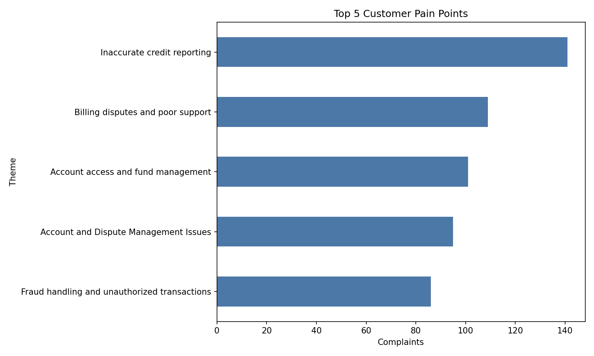
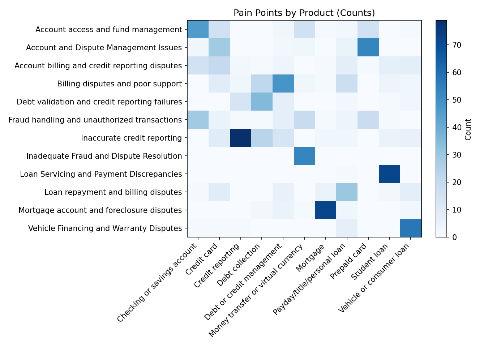
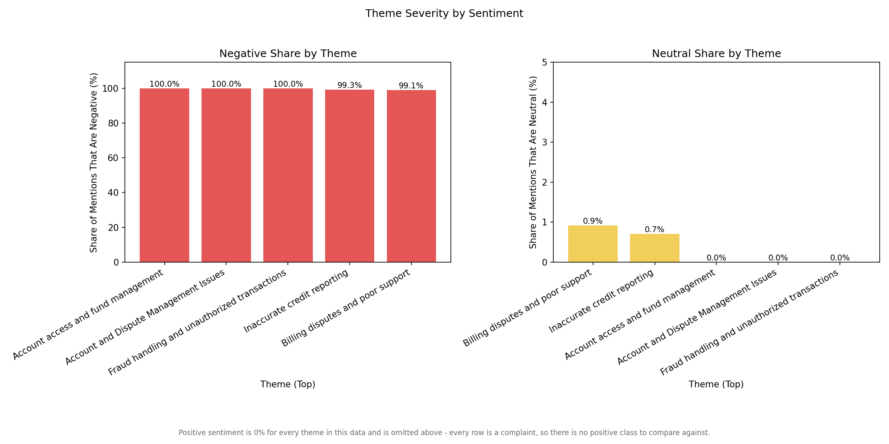
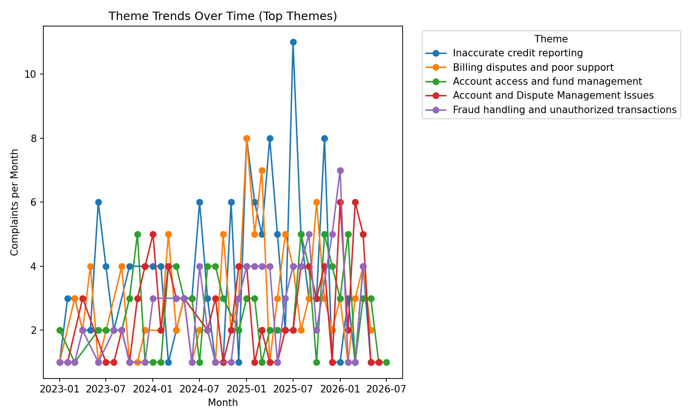
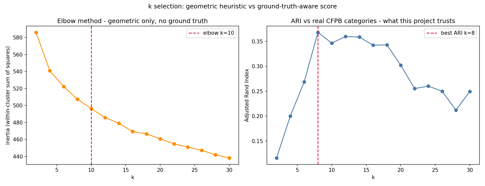

# Financial Services Customer Insights

An LLM pipeline that turns unstructured consumer complaints into a labelled,
analytics-ready dataset and four executive charts — and, unlike most pipelines
like this, **measures whether the clustering is actually right**, instead of
just producing plausible-looking output.

```
raw complaint (free text)
        │
        ▼
  ┌─────────────┐   ┌──────────────┐   ┌───────────────┐   ┌──────────────────┐
  │ 1. Extract  │──▶│ 2. Cluster   │──▶│ 3. Label      │──▶│ 4. Business       │
  │    topics   │   │    complaints│   │    clusters   │   │    insights       │
  └─────────────┘   └──────────────┘   └───────────────┘   └──────────────────┘
        │                   │                  │                     │
   LLM extracts       embeds each          LLM names each        4 executive
   2-5 issues per     complaint's full     cluster; one row       charts (pandas
   complaint           narrative, KMeans    per complaint          + matplotlib)
                        groups complaints
```

```
                              ┌────────────────────┐
                              │  eval/              │
                              │  cluster_eval.py     │◀── scores clusters against
                              │  choose_k.py          │    real CFPB `Issue` AND
                              └────────────────────┘    `product` labels
```

## Why this project exists

Most "LLM pipeline" portfolio projects extract topics, cluster them, and stop —
there is no way to tell whether the clusters mean anything. This one is built
around the [CFPB Consumer Complaint Database](https://www.consumerfinance.gov/data-research/consumer-complaints/),
chosen specifically because every complaint carries **two independent, real
category labels** — a fine-grained `Issue` (kept in a separate file, never
seen by the pipeline) and a coarse `product` (ordinary metadata, not a
secret). Those labels are used afterward to answer the question that actually
matters: *does the unsupervised clustering recover real structure, or did it
just look reasonable?*

See [`data.md`](data.md) for the full data pipeline: how CFPB's bulk complaint
export was filtered down to the working 3,000-row sample, every cleaning
step, and the reasoning behind each one.

---

## Example output

Real output from a 999-complaint run, k=12 (see
[Evaluating the clustering](#evaluating-the-clustering) for the ARI/NMI
behind these clusters). Regenerated by Step 4 on every run at
`artifacts/*.png`; these copies are committed separately under `docs/images/`
since `artifacts/` itself is gitignored pipeline output.

<table>
<tr>
<td width="50%">

**Top pain points**


</td>
<td width="50%">

**Pain points by product**


</td>
</tr>
<tr>
<td width="50%">

**Negative / Neutral share by theme**


</td>
<td width="50%">

**Theme trends over time**


</td>
</tr>
</table>

---

## Project structure

```
.
├── README.md                 this file
├── data.md                   how the dataset was built (extraction, cleaning, sampling)
├── main.py                   CLI entry point - runs all 4 steps in sequence
├── streamlit_app.py          web UI - run the pipeline, view results/eval without the CLI
├── requirements.txt
├── .env.example               copy to .env and add your API keys
├── .streamlit/
│   └── config.toml           sets the Streamlit UI's port (8503)
│
├── config/
│   └── settings.py           every path, model name, and tunable in one place
├── models/
│   └── llm_client.py         separate client factories for chat (Gemini) and
│                               embeddings (Voyage AI) - see "Provider configuration"
│
├── tools/                    the four pipeline steps - plain async functions
│   ├── topic_extraction.py       Step 1
│   ├── topic_clustering.py       Step 2
│   ├── cluster_labelling.py      Step 3
│   └── business_insight.py       Step 4
│
├── eval/                     ground-truth evaluation - the project's differentiator
│   ├── cluster_eval.py           ARI / NMI / per-cluster purity vs real labels
│   └── choose_k.py               sweeps k, scores by ARI, also plots the elbow method
│
├── orchestration/
│   └── agent_pipeline.py     optional: single Agent + system prompt decides step
│                               order, tools reached over MCP (main.py does NOT
│                               use this - see "Two ways to run it" below)
│
├── MCP/
│   └── server.py             exposes the four tools over MCP for external clients
│                               (Claude Desktop, VS Code Copilot, other agents)
│
├── scripts/                  one-time data preparation (see data.md)
│   ├── extract_from_bulk.py
│   └── prepare_cfpb.py
│
├── docs/
│   └── images/                committed copies of Step 4's charts, for this README
│                                ("Example output" below) - not gitignored, unlike artifacts/
│
├── data/
│   ├── input.csv               3,000 complaints - what the pipeline reads (no labels)
│   ├── ground_truth.csv        Issue/Sub-issue answer key, keyed by complaint_id
│   └── eval_holdout.csv        200-row slice for manual review (see Known limitations)
│
└── artifacts/                 pipeline output - regenerated by every run, gitignored
    ├── df_with_topics.csv         Step 1 output
    ├── df_with_clusters.csv       Step 2 output (adds one cluster_id per complaint)
    ├── output.csv                 Step 3 output (final labelled dataset)
    ├── complaint_embeddings.npz   cached narrative embeddings (reused across k sweeps)
    └── *.png                      Step 4's four charts + the elbow-method plot
```

---

## Setup

**Use a dedicated virtual environment for this project.** Installing `mcp[cli]`
into a Python environment shared with other projects broke an unrelated
project's `fastapi` install during development (`mcp`'s `FastMCP` hard-imports
SSE transport support, which pulled in a `starlette` version incompatible with
`fastapi`'s pin) - a real conflict, not a hypothetical one. An isolated venv
avoids it entirely.

```bash
git clone https://github.com/namitjain123/financeservice-customer-insight.git
cd financeservice-customer-insight

python -m venv .venv
.venv\Scripts\activate        # Windows
# source .venv/bin/activate   # macOS/Linux

pip install -r requirements.txt
```

**Two API keys are needed** - chat and embeddings are deliberately separate
providers (see [Provider configuration](#provider-configuration) for why):

```bash
copy .env.example .env        # Windows
# cp .env.example .env        # macOS/Linux
```

- `GEMINI_API_KEY` - free at [aistudio.google.com/apikey](https://aistudio.google.com/apikey)
- `VOYAGE_API_KEY` - free, no payment method required, at [dash.voyageai.com](https://dash.voyageai.com)

---

## Usage

### Run the full pipeline

```bash
python main.py            # all 999 rows in artifacts/df_with_topics.csv's source range
python main.py 30         # smoke test on the first 30 rows only - do this first
```

Always test on a small number before a full run. Steps 1 and 3 make real LLM
API calls; Gemini's free tier is rate-limited, so a full run takes a while and
is worth verifying end-to-end on 30 rows first. Step 2's embedding calls
(Voyage AI) are separately rate-limited to 3 requests/minute on the free tier,
so a full clustering run also takes several minutes regardless of row count.

Each step prints its own real return value - row counts, cluster sizes, token
usage - not a narrated summary. This is deliberate: seeing exactly what each
step did, from the step itself, is what catches a step silently doing the
wrong thing.

### Run one step at a time

```bash
python -m tools.topic_extraction 50      # first 50 rows only
python -m tools.topic_clustering 12      # k=12 clusters
python -m tools.cluster_labelling
python -m tools.business_insight 5       # top 5 themes per chart
```

### Run the web UI

```bash
streamlit run streamlit_app.py
```

Opens at `http://localhost:8503` (set in `.streamlit/config.toml`). Shows
whatever's already in `artifacts/` immediately on load - no need to click
"Run pipeline" just to look at existing results. Includes a "Run evaluation"
control to score the current clustering against `Issue` or `product` on
demand, with a per-cluster purity breakdown.

### Evaluate the clustering against ground truth

```bash
python -m eval.cluster_eval              # ARI, NMI, purity vs Issue (default)
python -m eval.cluster_eval product      # same, vs product instead

python -m eval.choose_k 2 30 2           # sweep k=2..30 step 2, vs Issue
python -m eval.choose_k 2 30 2 product   # same sweep, vs product
```

`choose_k.py` reuses the cached narrative embeddings from the last clustering
run, so sweeping many values of k costs zero additional API calls. It also
computes the classic elbow method (inertia vs k) alongside ARI and saves both
to `artifacts/plot_elbow_k_selection.png` - shown for comparison, not because
it's what actually picks k (see [Choosing k](#choosing-k) below for why).

### Two ways to run it: sequential calls vs. an Agent deciding

`main.py`'s default path is four plain `await` calls, in order:

```python
history = [
    {"step": "extract_topics", **await extract_topics()},
    {"step": "cluster_topics", **cluster_topics()},
    {"step": "label_clusters", **await label_clusters()},
    {"step": "generate_insights", **generate_insights()},
]
```

No framework needed to express "do these four things in order" - the pipeline
never branches, so there's no decision for an LLM or a workflow graph to make.

`orchestration/agent_pipeline.py` is an alternative, matching the original
version of this project's design closely: an AutoGen `AssistantAgent`, a
system prompt, and the same four tools reached over MCP (a spawned
subprocess) rather than imported directly - the original project's own
pattern, kept here specifically for that side-by-side comparison. It's
included for comparison, not used by default, for two real reasons:

1. **The agent's own narration is not the same as what actually happened.**
   In an earlier version of this project, exactly this pattern produced an
   agent that announced *"1,000 responses processed (for example)"* against a
   100-row file. `main.py`'s sequential version can't do that - there's no
   narration, only real return values.
2. **MCP here is pure overhead, not a benefit.** The tools live in this same
   codebase; reaching them through a spawned subprocess and JSON-RPC costs
   real, measurable time (~60-90s just to construct the agent, versus
   instant for a direct import) for no benefit, since there's no external
   caller to justify it. See `MCP/server.py`'s docstring for when MCP
   actually earns that cost.

```bash
python -c "import asyncio; from orchestration.agent_pipeline import run_agent_pipeline; print(asyncio.run(run_agent_pipeline()))"
```

### Run the MCP server

`MCP/server.py` exposes the four tools over the Model Context Protocol, so any
MCP-compatible client (Claude Desktop, VS Code Copilot, another agent) can
discover and call them without importing this codebase - a genuinely useful
capability for a caller that isn't Python code in this repo, unlike
`orchestration/agent_pipeline.py`'s internal use of it above.

```bash
python MCP/server.py                  # stdio server
mcp dev MCP/server.py                 # opens the MCP Inspector for interactive testing
```

To connect Claude Desktop: Settings → Developer → Edit Config, add an
`mcpServers` entry pointing `command` at this venv's `python.exe` and `args`
at the full path to `MCP/server.py`, then restart the app. No URL or port
needed - stdio servers are launched by the client as a subprocess, not
connected to over a network.

---

## The four steps

### Step 1 - Topic extraction (`tools/topic_extraction.py`)

Sends each complaint's narrative to Gemini, asks for 2-5 specific, actionable
topic phrases plus sentiment. *"Bad service"* is rejected by the prompt in
favour of *"Repeated failed dispute investigation"* - vague topics are what
produced a single cluster covering a third of all complaints in an earlier,
less careful version of this pipeline.

- **Concurrent**, not serial (`EXTRACTION_CONCURRENCY`, default 4)
- **Model fallback chain**: `gemini-3.5-flash-lite` → `gemini-3.1-flash-lite` →
  `gemini-flash-lite-latest`, so one model's rate limit doesn't stall the run
- **Checkpointed** every 100 rows and **resumable** - a crash partway through
  costs at most one checkpoint's worth of API calls, not the whole run
- Rows that fail extraction across the whole fallback chain are dropped, not
  kept with placeholder data - of 1,000 rows attempted in the current working
  set, 999 succeeded; one (`complaint_id 10175262`) failed and was excluded

### Step 2 - Clustering (`tools/topic_clustering.py`)

Embeds each complaint's **full narrative** (not the topic phrases from Step
1) via Voyage AI (`voyage-4-lite`, 1024 dimensions), L2-normalises the
vectors so Euclidean KMeans behaves as cosine clustering, and groups
complaints directly - one cluster per complaint, no intermediate voting step.

This wasn't the first design tried. An earlier version embedded the
*topic phrases* instead (deliberately abstracted away from product-specific
wording, e.g. "unauthorized charge" rather than "credit card annual fee
dispute"), then approximated each complaint's cluster via majority vote
across its 2-5 topics. That kept clusters focused on cross-product themes,
but capped ARI against CFPB's real labels around 0.10 - too low to trust the
resulting report. Embedding narratives directly raised it to 0.26-0.36 (see
[Evaluating the clustering](#evaluating-the-clustering)), at a real cost:
clusters now track known product lines more than they surface novel
cross-cutting themes. That tradeoff is made explicitly, not accidentally.

Embeddings are cached to disk (`artifacts/complaint_embeddings.npz`) -
re-clustering at a different k, or re-running `choose_k.py`'s sweep, costs
zero additional API calls. Batching is token-budgeted, not a fixed item
count: complaint narratives vary from ~230 to ~2,900 characters, so a fixed
"30 items per batch" can land anywhere from ~2,000 to ~10,800 estimated
tokens depending on which narratives happen to fall together - enough to
silently exceed Voyage's free-tier 10K-tokens-per-minute cap in a single
call. `_batch_by_tokens()` groups by an actual token budget instead, so every
batch sent is safely under the limit regardless of content.

`k` defaults to 12 (`config/settings.py`), a value that's been checked, not
assumed - see [Choosing k](#choosing-k) below.

### Step 3 - Cluster labelling (`tools/cluster_labelling.py`)

Shows each cluster's topic phrases (from Step 1) to Gemini, asks for a short
business-facing name (*"Inaccurate credit reporting"*, not a repeated topic
phrase verbatim), and attaches that label to every complaint in the cluster -
one row per complaint, since Step 2 now clusters complaints directly rather
than individual topic phrases.

### Step 4 - Business insights (`tools/business_insight.py`)

No LLM calls - pure pandas/matplotlib over Step 3's output. Four charts:

1. **Top N pain points** - which themes come up most often (counts complaints,
   not topic mentions - each complaint contributes to exactly one theme)
2. **Pain points by product** - heatmap of theme × product counts
3. **Negative and Neutral share by theme** - see the caveat below
4. **Theme trends over time** - monthly complaint counts for the top themes

Chart 3 was originally a single stacked Negative/Neutral/Positive bar.
Measured against real output, `Positive` sentiment is **0.0% for every
theme** - there's no such thing as a positive complaint in this dataset, not
just a rare one - so a 0-1 stacked chart made every bar look identical
regardless of theme, showing no real information. Rebuilt as two panels,
each independently scaled and labeled with its exact percentage: Negative
(88-100% across themes) and Neutral (0-11.5%, the only dimension that
actually varies), with Positive omitted and explained in a footnote rather
than drawn as a permanently-empty slice.

---

## Evaluating the clustering

This is what separates the project from "ran an LLM pipeline, made some
charts." `eval/cluster_eval.py` compares the pipeline's own clusters against
real CFPB category labels it never saw during clustering - **two** of them,
independently:

```
Adjusted Rand Index (ARI)         do my clusters group the same complaints
                                   together that the real category does?
                                   0 = random, 1 = perfect agreement

Normalized Mutual Info (NMI)      how much does knowing my cluster tell you
                                   about the true label?

Per-cluster purity                within one predicted cluster, what fraction
                                   share the same true category? Flags "junk
                                   drawer" clusters spanning many true labels.
```

**Current result, k=12, 999-row run (real, not a mechanism check):**

```bash
$ python -m eval.cluster_eval            # vs Issue (fine-grained, 60-80 categories)
n_complaints_evaluated: 901/999     n_categories_scored: 39/67
ARI: 0.2562        NMI: 0.4919        mean cluster purity: 0.3889

$ python -m eval.cluster_eval product    # vs product (coarse, 11 categories)
n_complaints_evaluated: 999/999     n_categories_scored: 11/11
ARI: 0.3596        NMI: 0.5002        mean cluster purity: 0.6166
```

Both scores exclude categories with fewer than `MIN_CATEGORY_SUPPORT` (10)
examples before computing ARI/NMI - a category with 1-4 examples can't be
recovered by any unsupervised method (there's no pattern to learn from a
single example), so scoring against it penalises the clustering for a task
that isn't learnable from this data, not for a real failure. For `Issue`,
that excludes 28 of 67 categories (98 complaints); `product`'s 11 categories
are all well above the threshold, so nothing is excluded.

**Reading these numbers honestly:** 0.36 is a real result - clustering is
demonstrably picking up structure that matches CFPB's real categorisation,
not noise dressed up as clusters. It is not close to 1.0, and shouldn't be
expected to be: short-text clustering against noisy real-world labels
typically reports ARI in the 0.2-0.4 range as a *good* result in published
work, not 0.7+. `Issue`'s lower score (0.26) reflects that it's a harder,
finer-grained target (60-80 categories vs 11) for the same 12 clusters to
resolve, not a worse clustering.

### Choosing k

`eval/choose_k.py` sweeps a range of `k` and scores each value by ARI against
a chosen ground truth - not by silhouette or the elbow method (inertia), both
of which are purely geometric and have no way to know whether a cluster
corresponds to anything real, only whether points sit tightly packed. Both
are still computed and plotted for comparison (`plot_elbow_k_selection.png`),
specifically to make that contrast visible rather than assumed.

```
k=2   ARI(product)=0.116   k=8   ARI(product)=0.368  ← best for product
k=6   ARI(product)=0.269   k=12  ARI(product)=0.360
k=10  ARI(product)=0.347   k=14  ARI(product)=0.359

k=12  ARI(Issue)=0.256      k=18  ARI(Issue)=0.273  ← best for Issue (2-40 range)
                             elbow (inertia, no ground truth): k=10
```

No single k wins on both targets - k=8 is best for the coarse `product`
taxonomy, k=18 for the fine-grained `Issue` taxonomy, and the geometric
elbow lands at k=10, close to but not identical to either. **k=12 was kept
as a deliberate compromise**: within ~2% of both optima rather than
maximising one at the expense of the other, and a value the ARI curve
plateaus near rather than one cherry-picked as a single highest point in an
otherwise-noisy sweep (the curve oscillates across a band, not a clean single
peak - picking the literal maximum found risks fitting sampling noise on a
~1,000-row set rather than a real structural fact about the data).



---

## Provider configuration

**Chat and embeddings are deliberately separate providers**, each with its
own client factory in `models/llm_client.py`. This wasn't a design choice
made up front - it's a direct response to a real failure encountered during
development: Gemini's free-tier chat quota and embedding quota are tracked
independently, and the embedding one is a hard **daily** cap (not
per-minute) with a reset time that didn't line up with local midnight -
retrying later the same day, or even the next day, didn't help. Chat/topic
extraction was unaffected and stayed on Gemini; embeddings moved to Voyage
AI, which offers a genuinely free tier (3 requests/minute, 10K tokens/minute,
200M free tokens total, no payment method required).

Both providers are reached through OpenAI-compatible endpoints, so the
standard `openai` Python package works unchanged for either - only the base
URL, key, and model names differ (`config/settings.py`). Swapping either
provider is a few environment variables, not a rewrite:

```bash
# .env - Groq instead of Gemini for chat (Groq has no embeddings API,
# so VOYAGE_API_KEY / embeddings config is unaffected)
GEMINI_BASE_URL=https://api.groq.com/openai/v1
GEMINI_API_KEY=<your groq key>
CHAT_MODEL=llama-3.3-70b-versatile

# .env - OpenAI instead of Gemini+Voyage for both chat and embeddings
GEMINI_BASE_URL=https://api.openai.com/v1
GEMINI_API_KEY=<your openai key>
CHAT_MODEL=gpt-4o-mini
EMBED_BASE_URL=https://api.openai.com/v1
VOYAGE_API_KEY=<your openai key - reused here, the var name just means
                "whatever key the embed client uses">
EMBED_MODEL=text-embedding-3-small
```

---

## Known limitations

**The sample is balanced, not representative.** `data.md` explains the
sampling in full - short version: real-world complaint volume by product is
not preserved, so the "top pain points" chart reflects category *diversity*
in the sample, not real-world *frequency*.

**Narrative-based embedding trades novel theme discovery for a trustworthy
ARI.** Embedding full narratives (rather than the abstracted topic phrases
an earlier version used) is what makes the ~0.36 ARI achievable - but it
also means clusters lean toward tracking known product lines rather than
surfacing cross-product themes a reader wouldn't already expect (e.g. "fraud"
as a pattern spanning five different products). Both the higher trust and
the narrower discovery are real; neither is hidden from the other in this
writeup.

**`k=12` is a deliberate compromise, not a single optimum.** See
[Choosing k](#choosing-k) - it's within ~2% of both `product`'s best (k=8)
and close to `Issue`'s best (k=18) in the range swept, chosen for balance
across both real label systems rather than maximising either alone.

**Sentiment is structurally almost all negative, with zero positive
examples.** Every row originates from a complaint - nobody files one to say
they're happy. Chart 3 was rebuilt around this fact (see Step 4 above)
rather than presenting a Positive category that's always empty.

**Ground truth is consumer-selected, not expert-adjudicated.** `Issue` is
chosen by the complainant from a dropdown at filing, not assigned by someone
who read the narrative - it's noisy ground truth, better than none, but any
ARI/NMI number should carry that caveat.

**`eval_holdout.csv` is not a genuinely disjoint holdout.** It's a 200-row
slice set aside early for manual spot-checking, but it's drawn from the same
pool as `ground_truth.csv`/`input.csv` rather than a truly separate sample.
It isn't used by any of the actual ARI/NMI scoring in `eval/`, but shouldn't
be over-claimed as held-out validation if asked specifically about it.

**MCP adds latency, not speed, everywhere it's used in this repo.** See
[Two ways to run it](#two-ways-to-run-it-sequential-calls-vs-an-agent-deciding)
above - `orchestration/agent_pipeline.py` uses it deliberately, as a
comparison against the original project's design, not because it helps.
`MCP/server.py` itself is the one place it's genuinely useful: external,
non-Python callers with no other way to reach these tools.
